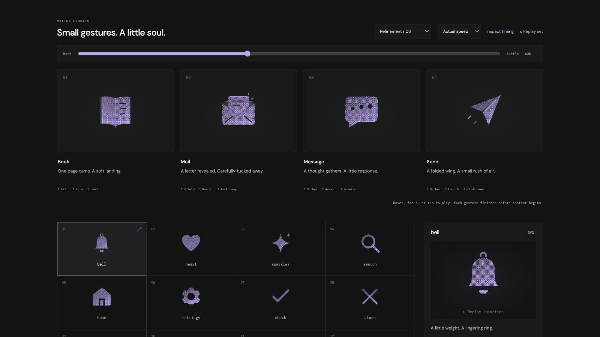

# send: Interface Craft refinement 03

## Context
**Meaning:** direct a message toward its destination. **Invariant:** a complete paper plane, diagonal keel, and forward direction remain inside the icon frame. The preview communicates intent, not successful delivery.

## First Impressions
The previous plane moved as a single slab with a faint crease and two small trailing strokes. It had direction, but its material never responded to the launch. The wake lacked a clear build and follow-through.

## Visual Design
Give the plane two distinct paper faces: a quieter upper wing and full-strength lower wing. The lower wing flexes about the diagonal keel from (10,14) to (20,4). Both hinge endpoints stay fixed relative to the plane, preserving the fold while the entire plane moves.

A crease glint travels with the plane. Two short wakes remain in the surrounding space, with separate starts, strengths, and peaks. They extend behind the departure before dissipating. The silhouette keeps enough margin for the complete gesture and outline stroke.

## Interface Design
The nose draws back; the wing gathers a little later. The nose then leads forward and upward, followed by the wing's release and attached crease light. A stronger near wake crests first, a smaller distant wake answers, and the plane coasts before easing home. This supplies a launch climax without sending the icon out of its control.

## Consistency & Conventions
MOT-01–16 apply. The same affine hinge contract used for File's corner keeps Send's keel attached. Stable dither follows each paper face. No checkmark, disappearing plane, or delivery claim is introduced. The native and exported timelines share every actor.

## User Context
Send can be consequential. A small paper response provides tactility without pretending a message was delivered. At 24px, the two faces read as one conventional plane. The still and reduced-motion versions preserve the complete glyph.

## Top Opportunities addressed
1. Give the folded material a delayed response to the plane's impulse.
2. Anchor both ends of the keel throughout the wing flex.
3. Build a two-stage wake after the launch, then coast and return cleanly.

## Encoded storyboard
Source: [send.ts](../../src/motions/send.ts). `TIMING`, `SEND_ART`, `SEND_HINGE`, `PLANE`, `WING`, `GLINT`, `WAKE`, and `EASE` define the performance.

| Time | Action |
| --- | --- |
| 0–135ms | Plane draws back −0.65 / +0.5 units and aims −3.5°. |
| 180ms | Lower wing gathers to 90% perpendicular projection. |
| 340ms | Nose leads forward +0.85 / −0.9 units. |
| 400 / 410ms | Wing releases, then attached crease glint crests. |
| 435 / 505ms | Near and far wakes reach different peaks. |
| 615ms | Plane continues into a small forward coast. |
| 835–1010ms | Wakes clear during return; a tiny correction resolves. |
| 1220ms | Exact neutral plane. |

## Rendered review
Normal and half-speed playback show wing lag and the staggered wake without losing the plane. The 40% reference captures its launch response. Dither, light solid, and outline retain the joined folded form. Tests hold both keel endpoints fixed between poses, while the browser verifies the whole composed flight at real speed.

[Rest](../motion-evidence/refinement-03/rest.png) · [Preparation](../motion-evidence/refinement-03/prepare.png) · [Outline](../motion-evidence/refinement-03/outline.png) · [24px solid](../motion-evidence/refinement-03/compact-communication.png) · [Batch validation](../VALIDATION.md#focused-refinement-03--2026-09-09)
