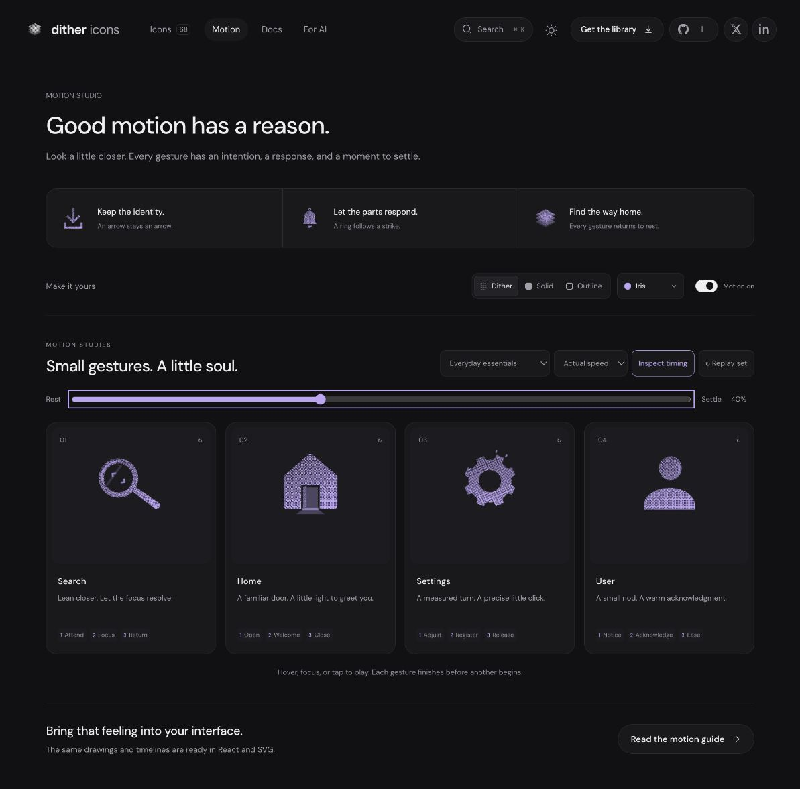

# Settings: Interface Craft refinement 05

## Context
**Make a measured adjustment.** Settings appears in the command palette and `app/src/routes/settings.tsx:103`. This finite preview must not certify preference persistence or imply loading.

## First Impressions
The user rejected the spring bow inside the gear: its arc cluttered the aperture and competed with the familiar Settings silhouette. The mechanical explanation did not justify the extra drawing. This correction supersedes that interior mechanism.

## Visual Design
Eight softly filleted teeth surround a completely empty circular center. Removed the inner tab, spring bow, internal index and contact ring. One outer tooth receives a short straight highlight; two tiny exterior ticks follow. Both disappear at rest. No accent crosses the aperture.

## Interface Design
The gear gathers by four degrees, advances to 22.5 degrees and holds. That stop precedes the highlight; the ticks answer the highlight 70ms later. The response stays attached to the same tooth as the gear returns. Its fixed center, even tooth spacing and finite travel keep it recognizable throughout.

## Consistency & Conventions
MOT-01/03/05/06/07/08/10/11/12/13/15/16: preserve negative space, make the response follow the stop, keep the texture attached and return exactly to rest. A causal gesture does not require inserting a literal mechanism into an established symbol. Platform UI-2/4 and MOTION-6/7 preserve familiar identity and reduced-motion behavior. MOT-14 leaves preference persistence to the host.

## User Context
At 24px the hollow gear remains immediately readable. At study size the brief rim response rewards inspection without adding permanent ornament. React finishes after keyboard departure; standalone SVG retains its documented hover lifecycle.

## Top Opportunities
1. Protect the clear center throughout the gesture.
2. Keep the payoff on the existing silhouette.
3. Let timing and restraint carry the adjustment, without explanatory machinery.

## Encoded storyboard and review
[settings.ts](../../src/motions/settings.ts) owns the source. Duration **1360ms**; stages **Adjust / Register / Release**.

```text
0        120             410   470   540       710   860       1170    1360
rest --> gather -------- stop--glint--ticks --- hold--clear --- home --- rest
center: empty ---------------------------------------------------- empty
```

Browser review: inspected rest and 40% response in dither, solid and outline. The aperture stays clear; only the outer tooth responds. Keyboard replay completed after Tab departure and restored the exact resting pose at approximately 1378ms; reduced-motion replay kept all transforms absent and accents hidden. The updated SVG board covers 112px and 48px dither plus 24px solid and outline. Targeted tests protect exterior accent geometry and hidden-until-registration timing.



[Rest](../motion-evidence/refinement-05/settings-clean-center/rest.png) · [Outline](../motion-evidence/refinement-05/settings-clean-center/outline-response.png) · [Small sizes](../motion-evidence/refinement-05/size-and-export.png) · [Validation](../VALIDATION.md#settings-center-correction--2026-09-10)
