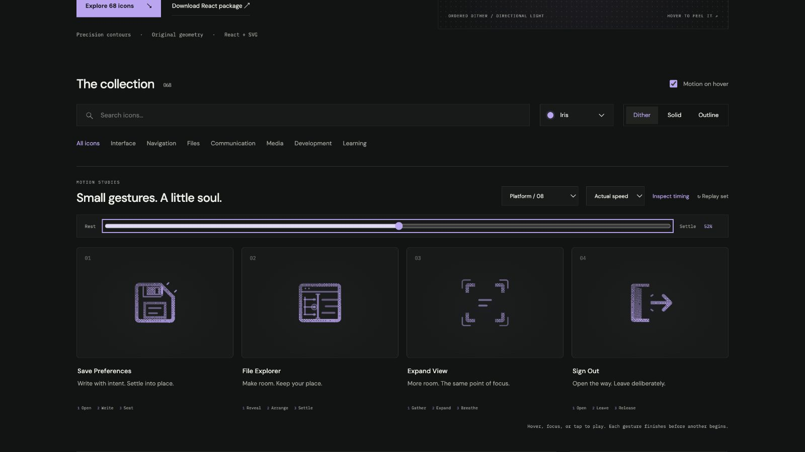

# Sign Out: Interface Craft review

## Context

**Leave the authenticated account session.** Actual platform call site: `routes/settings.tsx:170–179` calls originSession.signOut() for the authenticated state; it currently shares ShieldCheck with Sign in.

## First Impressions

A fixed doorway and rightward arrow make leaving explicit. A door leaf can uncover the route, but its hinge and the arrow direction must remain reliable.

## Visual Design

**Identity boundary:** The frame is fixed; both hinge endpoints stay attached. The arrow always points right and its head remains visible. Its knockout follows the actual moving leaf.

## Interface Design

Door opens around its full hinge; the arrow passes the threshold. Two close threshold witnesses answer after passage. The arrow returns before the door closes.

## Consistency & Conventions

MOT-01/03/05 bind meaning, causal attachment and stable references. MOT-07/08/16 bind attached grain and a localized climax. MOT-09–15 bind completed playback, exact rest, keyboard, stillness, shared export timing and individual rendered review. Platform handoff: UI-2/4, COLOR-2/5, A11Y-2/4 and MOTION-1/4/6/7.

## User Context

Apply only to the authenticated Sign out state. Keep Sign in separate. Never bind gallery playback to account mutation; the real session and disabled state remain authoritative. Frequent compact controls should use still solid/outline, with their native target and accessible label. Use the full dither gesture for larger, infrequent entry points.

## Top Opportunities

1. Preserve the familiar control silhouette through every frame.
2. Stage the response after its physical cause, at the relevant part.
3. Keep the static variant and the real platform state authoritative.

## Encoded storyboard and review

**Open / Leave / Release · 1540ms.** [sign-out.ts](../../src/motions/sign-out.ts) records the timestamp storyboard and named actors; [PlatformActionsArtwork.tsx](../../src/PlatformActionsArtwork.tsx) owns the original drawing.

| Actor | Timing and attachment |
| --- | --- |
| Door leaf and knockout | Shared matrix about x=5.2; open at 340ms with both hinge endpoints fixed |
| Arrow | Waits through opening; travels right 2.1px by 660ms; returns at 1210ms |
| Threshold witnesses | Peak 750ms after passage; clear 940ms |
| Door closure | Begins after arrow is home; closes at 1350ms; rest at 1540ms |

The door leaf and its arrow occluder share the entire matrix clock. Both ends of the hinge remain fixed even between frames. The arrow keeps its head, direction and opacity throughout; only the initially hidden shaft is uncovered. Solid and outline make the same opening, passage and closure sequence legible. This is an action affordance, never an account-state result.

Actual and half-speed sequences reviewed through recovery. Eight native poses at 0/10/24/34/46/52/82/100% have identical initial/final computed states. Dither, outline and solid retain the same 52% pose. Each icon was keyboard-replayed, allowed to finish after Tab departure, cancelled under reduced motion and disabled with motion off. Light/dark, 24px solid, 64px dither and a 390px two-column layout were inspected. See [batch validation](../VALIDATION.md) for evidence and limits.

**Reference position: 4 of four.**

[Rest](../motion-evidence/platform-08/pose-0.png) · [Outline](../motion-evidence/platform-08/outline-52.png) · [Light solid](../motion-evidence/platform-08/light-solid-52.png) · [Compact](../motion-evidence/platform-08/collection-solid-24.png)
