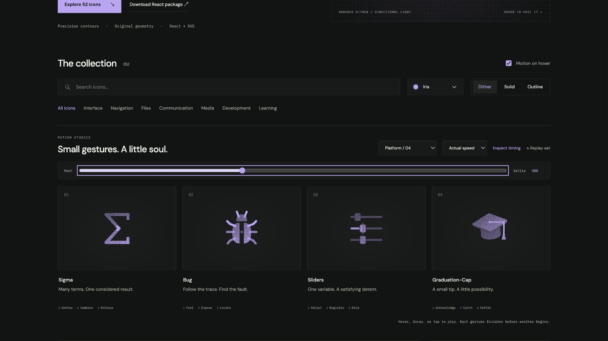

# sliders: Interface Craft review

## Context

**Adjust one variable against a stable reference.** CraftingAttention's `BackpropFlow.tsx:424–440` exposes three independent parameter sliders in Explore mode. `GradientDecayExplorer.tsx:846–878` has Sigma and sequence-length controls. This new icon covers parameter adjustment; it is a proposed affordance for those real controls, not a replacement for an existing Sliders import.

## First Impressions

Three rails with distinct thumb positions communicate independent variables. Animating every fader would imply arbitrary or linked parameter changes. Keeping two fixed lets one precise adjustment carry the story.

## Visual Design

Three equally spaced rails have a quiet baseline and rounded compact thumbs. Only the middle rail's filled portion and thumb move. Its knockout travels with the thumb so no rail passes through the knob, including in outline. The fixed first/third controls maintain orientation. The response uses two short detent marks outside the thumb and an attached edge light.

**Identity boundary:** Three controls remain visible. The active thumb stays on its rail and inside its endpoints. The filled rail terminates at the thumb's center at every interpolated position, not only at authored keyframes. Both other controls remain unchanged.

## Interface Design

The middle thumb takes up a little resistance, moves left, exceeds its destination by only .18 units, then seats exactly at x=10. Edge light accompanies seating. The two detent marks answer 65ms later. Hold the registered position, clear the response, and quietly restore the demonstration's starting value.

## Consistency & Conventions

MOT-01/03/05 keep the knob, knockout, and filled rail in one physical relationship. Identical clock and easing maintain that relationship between frames. MOT-08/16 tie the climax to actual registration. MOT-07/09–15 preserve material, complete playback, exact rest, accessibility, shared export timing, and individual review. Platform handoff: UI-2/4, COLOR-2/5, A11Y-2/4, MOTION-1/4/6/7.

## User Context

A real parameter control remains native, labeled, and keyboard-adjustable. This decorative icon must never move a real value or suggest linked parameters. Prefer a still solid/outline icon in repeatedly manipulated control groups; reserve the full performance for a larger Explore affordance.

## Top Opportunities

1. Make the user feel one deliberate adjustment.
2. Preserve rail/thumb continuity through the entire motion.
3. Let an exact destination produce the detent response.

## Encoded storyboard and review

**Adjust / Register / Hold · 1380ms**. [sliders.ts](../../src/motions/sliders.ts) defines one knob-pose table used by the thumb, knockout, and proportional fill. [PlatformToolsArtwork.tsx](../../src/PlatformToolsArtwork.tsx) owns isolated instance masks.

| Actor | Key times (ms) |
| --- | --- |
| Middle thumb and knockout | 130 gather; 420 arrival overshoot; 500 seat; 680 hold; 1130 home |
| Filled rail | Exact same clock/easing; endpoint follows the thumb |
| Thumb edge | 500 peak; 840 clear |
| Detent marks | 565 peak; 840 clear |

Actual and half-speed playback reviewed. Eight poses return exactly. Dither/outline/solid keep the inspected 48% position, including the invisible knockout. See [batch validation](../VALIDATION.md) for keyboard, stillness, and responsive states.

**Reference position: 3 of four.**

[Rest](../motion-evidence/platform-04/pose-0.png) · [Outline](../motion-evidence/platform-04/outline-48.png) · [Light solid](../motion-evidence/platform-04/light-solid-48.png)
