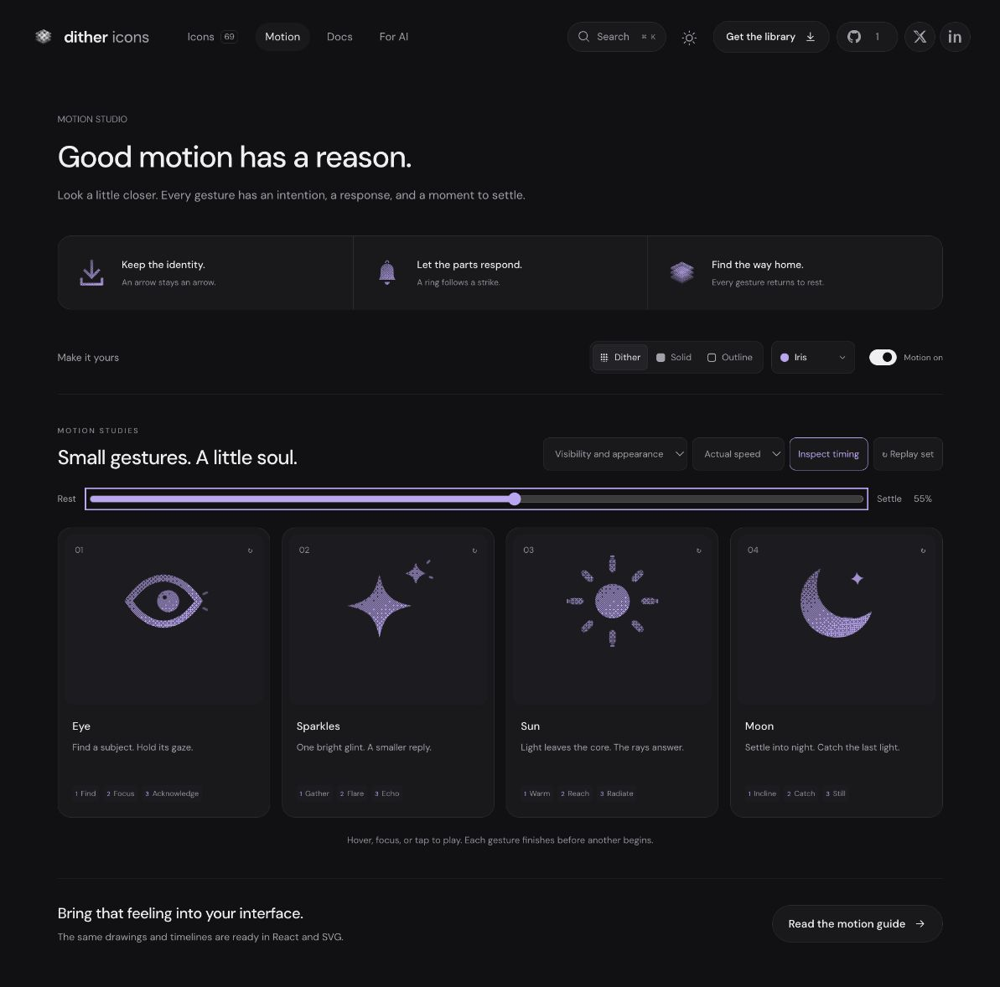

# Sparkles: Interface Craft refinement 07

## Context
**Emphasis and discovery.** Sparkles is a moment of emphasis or discovery. The platform uses it in paths.universe.tsx:318 and profile badges in u.$handle.tsx:343/546. It must not impersonate loading, an AI result or an achievement.

## First Impressions
The original main star filled the cell and the satellite was barely legible. Both rotated and scaled, giving the pair a generic wobble. Their exchange needed clearer hierarchy and a finish belonging to each event.

## Visual Design
A concave four-point main star at (9.8,13.2), radius 8.1, leaves space for the radius-2.7 satellite at (19.1,4.9). The main star stays over twice the satellite radius at every authored extreme. Both retain their axes. Browser review reduced the satellite outline to 1.05 units so its small interior stays open beside the main star’s 1.4-unit contour. Fine vertical tip marks belong to the main flare; two small diagonal marks belong to the satellite reply.

## Interface Design
Gather at 120ms; the main star stretches vertically at 310ms. Its tip response peaks at 370ms. As the main relaxes across at 410ms, the satellite gathers and then catches the glint at 555ms. Its exterior reply peaks at 625ms. Both stars remain present and return to their exact proportions without tumbling.

## Consistency & Conventions
MOT-01/02/03/04/05/06/07/08/09/10/11/12/13/14/15/16. Use the existing native playback, shared CSS timeline and frame inspector. Each icon has its own geometry and timing module. Reduced motion and motion-off retain the complete static symbol. Standalone CSS hover stops on departure; React completes the gesture.

## User Context
One bright emphasis with a clear secondary reply. No particle shower, spinner, repeated shimmer or persistence after the gesture. The quieter satellite remains readable at compact size.

## Top Opportunities
1. Separate the two centers and give the satellite a readable size.
2. Exchange a vertical flare for a delayed smaller reply.
3. Keep tips and echoes tied to their own arrivals.

## Encoded storyboard and rendered review
[sparkles.ts](../../src/motions/sparkles.ts), **1220ms**, **Gather / Flare / Echo**.

```text
0 — 120 gather — 310 flare — 370 tips — 410 pass — 555 catch — 625 echo — 790 clear — 980 home — 1220 rest
```

[Current browser evidence](../motion-evidence/refinement-07/) records inspected poses, actual/half-speed playback, keyboard completion, material continuity, reduced motion and compact exports. These supersede the broad-rollout references for this icon. Implementation review does not claim user acceptance or a production release.


