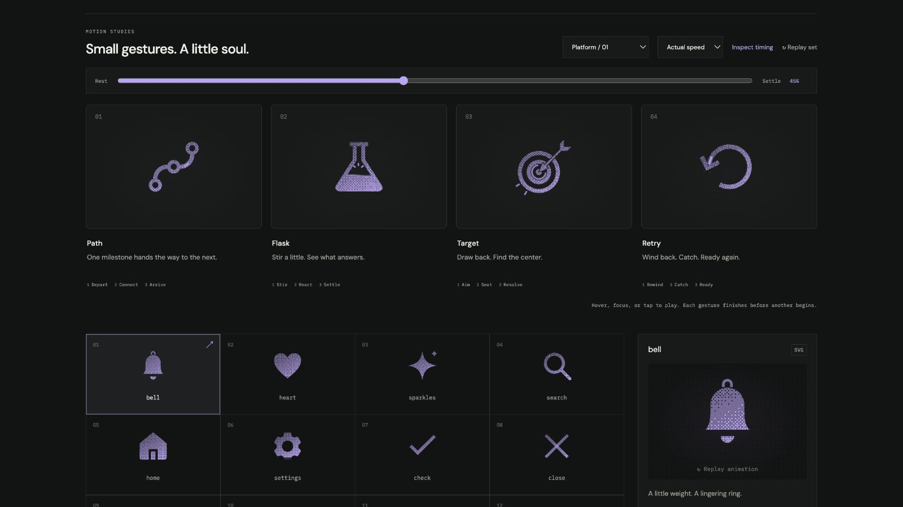

# target: Interface Craft review

## Context

New platform icon: **focus a learner objective**. Selected from observed CraftingAttention flows; see [PLATFORM-ICONS.md](../PLATFORM-ICONS.md).

## First Impressions

Placement and onboarding use Target badges around capability and evidence goals. The new icon should express intent and precision without suggesting a grade or celebrating unearned mastery.

## Visual Design

Two concentric rings sit behind one diagonal dart. Its point, shaft, and fletching share a rigid frame. A synchronized moving occluder prevents the dart and rings from accumulating grain at intersections.

## Interface Design

The dart draws back along its axis, seats at the center, and gives the receiving inner ring a small yield. A center response precedes two opposite rim strokes. The rings provide a stable reference.

**Identity boundary:** The target and complete dart persist. The point stays on its shaft axis. No checkmark, score, or completed assessment state is introduced.

## Consistency & Conventions

MOT-01–08 preserve identity, parts, stable references, and attached grain. MOT-09–13 bind completion, exact rest, reduced motion, common timing, and rendered verification. MOT-14–16 require truthful preview semantics, an individual review, and a perceptible causal climax. Platform handoff rules: UI-2, A11Y-2/4, COLOR-2, MOTION-1/6/7. The native parent supplies its real action and accessible name.

## User Context

The Learner may be concentrating on difficult work. Keep the glyph useful while still. Prefer solid or outline at 24px; use dither at 48px and larger. In high-frequency platform controls, use a still icon or short state feedback under MOTION-6; this full gesture is an optional invitation, never the sole state cue.

## Top Opportunities

1. Express **focus a learner objective** through the causal sequence above.
2. Preserve the listed identity boundary during every intermediate pose.
3. Keep the climax localized, then finish completely instead of looping.

## Encoded storyboard

**Aim / Seat / Resolve · 1260ms**

150ms draw back; 405ms contact; 455ms ring yields; 505ms center response; 570ms rim response; 1000ms dart still; 1260ms rest.

The timestamp storyboard and single `TIMING` object are in [target.ts](../../src/motions/target.ts). Geometry binds in [LearningArtwork.tsx](../../src/LearningArtwork.tsx). Native React, CSS export, and the inspector share these tracks.

| Named part | Keyframe times (ms) |
| --- | --- |
| `dart` | 0, 150, 405, 455, 555, 1000, 1260 |
| `dart-occlusion` | 0, 150, 405, 455, 555, 1000, 1260 |
| `inner-ring` | 0, 405, 455, 650, 900, 1260 |
| `center-response` | 0, 405, 505, 865, 1260 |
| `rim-response` | 0, 455, 570, 1000, 1260 |

## Rendered review

Reviewed at actual and half speed and at 0%, 10%, 28%, 36%, 45%, 65%, 82%, and 100%. Dark Iris dither/outline and light Cobalt solid preserve the silhouette and causal response. All computed parts match at 0% and 100%; paused material changes preserve the 45% pose. All four were inspected together at 24px solid and 64px dither. Keyboard departure completes, reduced motion is static, and motion-off disables playback. See [VALIDATION.md](../VALIDATION.md) for recorded evidence and limits.

**Reference position: 3 of four.**

[Rest](../motion-evidence/platform-01/pose-0.png) · [Preparation](../motion-evidence/platform-01/pose-10.png) · [Recovery](../motion-evidence/platform-01/pose-82.png) · [Outline](../motion-evidence/platform-01/outline-45.png) · [Light solid](../motion-evidence/platform-01/light-solid-45.png)
