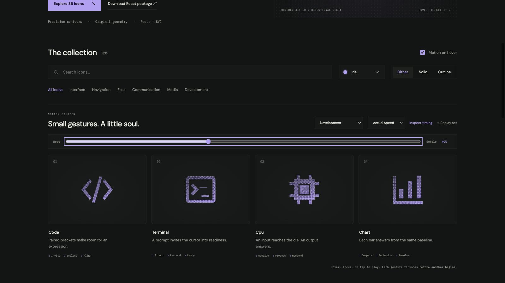

# terminal: Interface Craft review

## Context
An SVG action icon in a reusable developer library. Its semantic meaning is **a command prompt ready for input**. It appears in routine controls where recognition matters more than spectacle.

## First Impressions
A cursor blink alone offers little character and can repeat distractingly.

## Visual Design
**Identity boundary** — Keep the terminal frame, prompt, and cursor. Stable dither follows the contour. Color inherits the selected palette; accents use the same ink and stay below the primary silhouette in visual weight. Typography and card framing belong to the shared inspector, not the glyph.

## Interface Design
The missed opportunity is to express **a command prompt ready for input** through a causal gesture. Prompt leans into the line; a short line response follows; cursor compresses and resumes its steady state. The inspector exposes replay and timing only when requested; the icon itself adds no controls or labels.

## Consistency & Conventions
Retain the conventional glyph. Use the shared hover, focus, click, reduced-motion, and completion contracts. MOT-01, MOT-02, MOT-03, MOT-04, MOT-05, MOT-08, MOT-09, MOT-10, MOT-11, MOT-12, MOT-14, MOT-15 apply.

## User Context
This is readiness feedback, not simulated command execution. Recognizability must survive a brief glance and the still-motion variant.

## Top Opportunities
1. Prompt leans into the line; a short line response follows; cursor compresses and resumes its steady state.
2. Keep the terminal frame, prompt, and cursor.
3. This is readiness feedback, not simulated command execution.

## Encoded storyboard and review

**Duration:** 1160ms. **Sequence:** Prompt / Respond / Ready.

Timing source: [development.ts](../../src/motions/development.ts). Geometry binds each named track in `CraftedArtwork.tsx` or `ExtendedArtwork.tsx`. Times below are milliseconds from the same clock; transform values, pivots and easing live in that source.

| Named part | Keyframe times (ms) |
| --- | --- |
| `prompt` | 0, 130, 360, 520, 830, 1160 |
| `cursor` | 0, 300, 440, 610, 820, 1030, 1160 |
| `line-light` | 0, 280, 500, 740, 1160 |

**Rendered review:** The terminal frame anchors the advancing prompt. The short response line precedes the cursor recovery; no fabricated command output appears.

Reviewed at preparation (20%), action (40%), recovery (70%) and neutral endpoint (100%), with actual playback and per-part endpoint inspection in the live gallery. These samples establish the reviewed poses; they do not replace the full timeline or the shared lifecycle checks in [VALIDATION.md](../VALIDATION.md).

**Visual reference:** icon 2 from the left in this family.

[Preparation image](../motion-evidence/rollout/development-prepare.png) · [Recovery image](../motion-evidence/rollout/development-recover.png)
