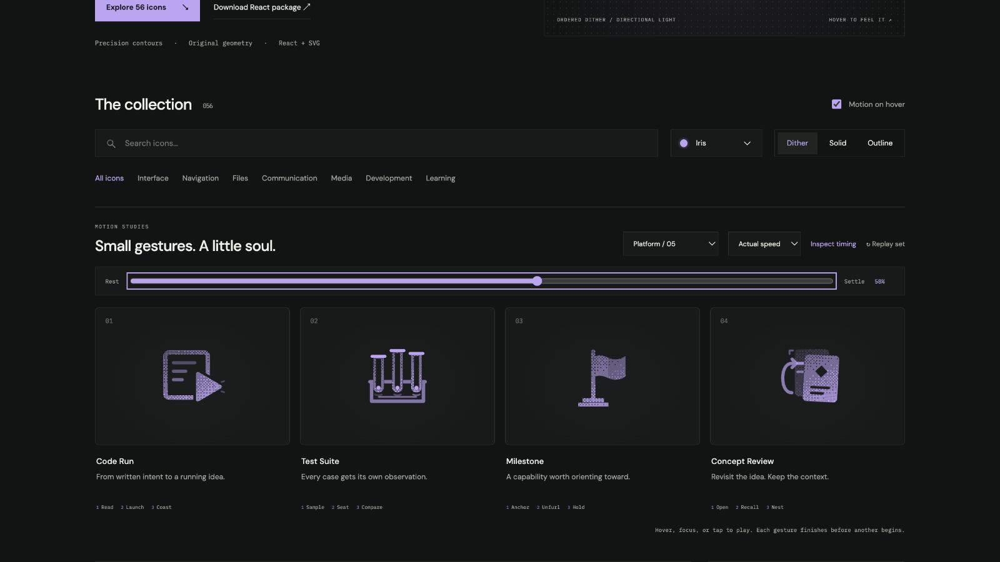

# Test Suite: Interface Craft review

## Context

**Observe independent test cases in one collection.** `lab.$slug.tsx:657` names Run tests. `problem.$slug.tsx:2913–2925` runs visible tests. Under ADR-0005, these browser results do not replace server grading.

## First Impressions

Three tubes in a stable rack show multiple observations. Dots remain specimens, with no pass/fail checkmarks or state colors.

## Visual Design

Each .7-radius dot seats at y=15.9, touching its chamber floor at y=16.6. Clips follow the real chambers; rack occlusion avoids rails through glass.

**Identity boundary:** Three separate chambers and samples remain visible; a sample never crosses its chamber wall or passes through the floor.

## Interface Design

The cases prepare and contact 140ms apart. Each contact has its own seat light; the fixture datum answers only after all cases have seated. Hold, then restore all three specimens.

## Consistency & Conventions

MOT-01/02/03/05 preserve meaning, identity, and physical relationships. MOT-07/08/16 bind grain and light to the cause. MOT-09–15 require completed playback, exact rest, reduced-motion support, shared export timing, individual review, and no invented app result. Platform handoff: UI-2/4, COLOR-2/5, A11Y-2/4, MOTION-1/4/6/7.

## User Context

Use a native labeled control for keyboard and touch. Prefer still solid/outline at 24px for repeated actions, and dither at 48px or larger. Motion remains optional; disabled/reduced-motion controls retain their meaning. The library gesture does not change platform state.

## Top Opportunities

Seat reactions follow actual contact, and the collection response waits for the final case rather than implying success after the first.

## Encoded storyboard and review

**Sample / Seat / Compare · 1460ms.** [test-suite.ts](../../src/motions/test-suite.ts) contains the timestamp storyboard, named actors and clock. [LearningWorkflowArtwork.tsx](../../src/LearningWorkflowArtwork.tsx) owns their original contours and instance-scoped masks.

1460ms total; contacts 370/510/650; final seats 500/640/780; datum 860; clear 1010; return begins 1050; home 1260.

Actual and half-speed playback reviewed. Eight reference poses return exactly; dither/outline/solid retain the same 52% transforms, origins and opacity. Keyboard departure, reduced motion, motion-off, 390px layout, 24px solid and 64px dither were inspected. Semantic name and use-case search verified. See [batch validation](../VALIDATION.md).

**Reference position: 2 of four.**

[Rest](../motion-evidence/platform-05/pose-0.png) · [Outline](../motion-evidence/platform-05/outline-52.png) · [Light solid](../motion-evidence/platform-05/light-solid-52.png) · [Compact silhouettes](../motion-evidence/platform-05/collection-24-solid.png)
