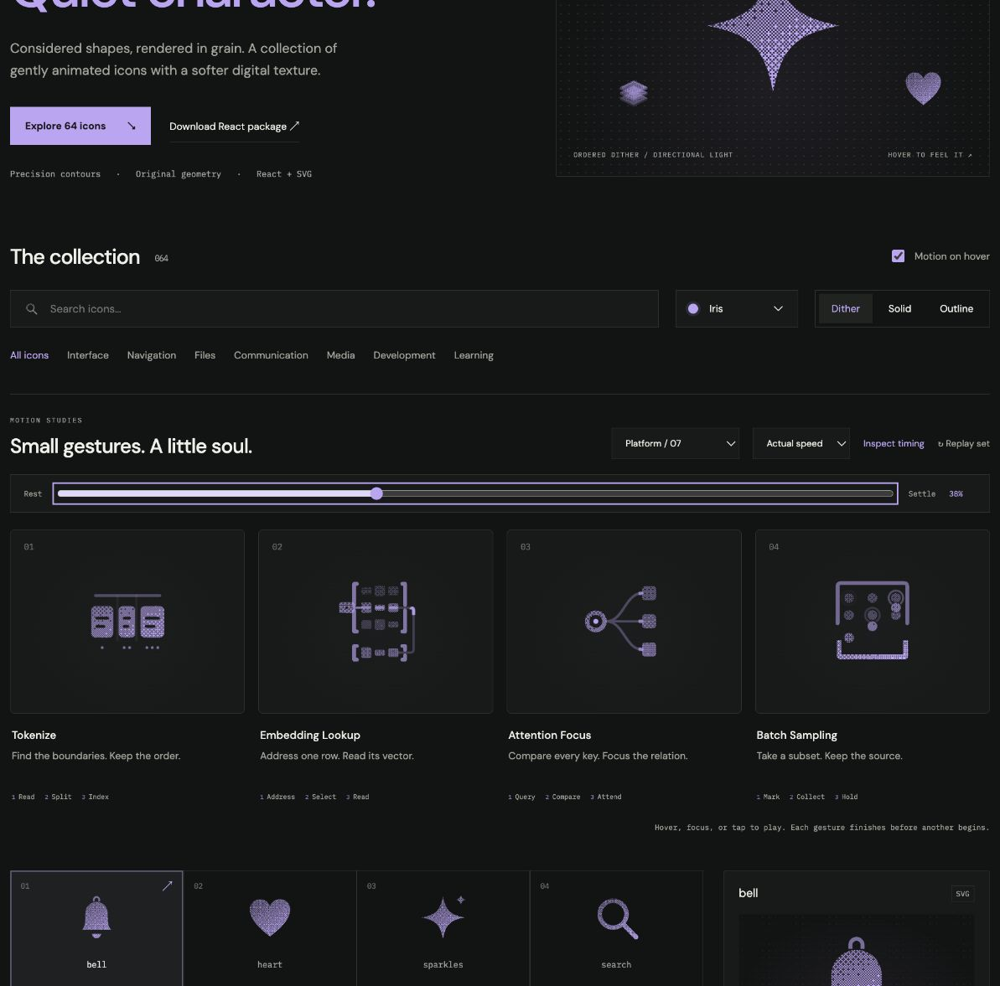

# Tokenize: Interface Craft review

## Context

**Separate text into ordered subword tokens.** `TokenizerViz.tsx:586–609` accepts Text to tokenize and exposes a Tokenized result.

## First Impressions

Three unequal text pieces should read as parts of one sequence, rather than three arbitrary floating blocks.

## Visual Design

A quiet text rule above three rounded, differently sized tiles; each retains its own inset text mark. Preserve sequence and spacing through separation.

**Identity boundary:** All three pieces and their text marks remain intact and ordered; no glyph becomes a particle.

## Interface Design

Read along the source rule, emphasize two boundaries, separate only the outer tokens, then reveal a small ordinal witness under each piece. Each witness belongs to its token.

## Consistency & Conventions

MOT-01/02/03/05 preserve meaning, identity and causal references. MOT-07/08/16 require attached grain and a localized response. MOT-09–15 govern completed playback, exact rest, input/stillness, shared export timing and individual rendered review. Platform handoff: UI-2/4, COLOR-2/5, A11Y-2/4, MOTION-1/4/6/7.

## User Context

The icon previews segmentation; it does not claim an exact tokenizer result, language-specific split, or token budget. Use native labeled controls. Keep small, frequently used icons still in solid/outline; dither benefits from 48px or larger. Keyboard, reduced motion and motion-off retain a complete static drawing.

## Top Opportunities

Give each boundary a visible reason before the pieces separate; keep ordinal cues subordinate.

## Encoded storyboard and review

**Read / Split / Index · 1420ms.** [tokenize.ts](../../src/motions/tokenize.ts) records the timestamp storyboard and named actors; [DataFlowArtwork.tsx](../../src/DataFlowArtwork.tsx) owns the geometry.

| Actor | Timing and attachment |
| --- | --- |
| Reading light | Peak 140ms, clears at 280ms |
| Boundaries | At x=9.4 and 14.2; peak 280ms before separation |
| Three pieces | Outer offsets −.8 / +.8 at 470ms; middle stays anchored; close by 1200ms |
| Ordinal witnesses | One, two and three dots, nested within their own piece; peak 560ms, clear 860ms |

The unequal token widths and retained text marks preserve sequence identity. Separation reveals existing boundaries; it does not arbitrarily cut through letters. The small index witnesses provide the late response without scattering the pieces.

Actual and half-speed playback reviewed through return. Eight reference poses at 0/10/20/38/52/62/82/100% have identical initial/final computed states. Dither, outline and solid retain the same 62% pose. Keyboard replay and Tab departure, reduced-motion cancellation, disabled motion, light/dark, compact sizes and narrow layout were inspected; details and limits are in [VALIDATION.md](../VALIDATION.md).

**Reference position: 1 of four.**

[Rest](../motion-evidence/platform-07/pose-0.png) · [Outline](../motion-evidence/platform-07/outline-62.png) · [Light solid](../motion-evidence/platform-07/light-solid-62.png)

This completed concept study is retained at the user's request. Future candidates must follow the platform interface selection policy in [PLATFORM-ICONS.md](../PLATFORM-ICONS.md).
