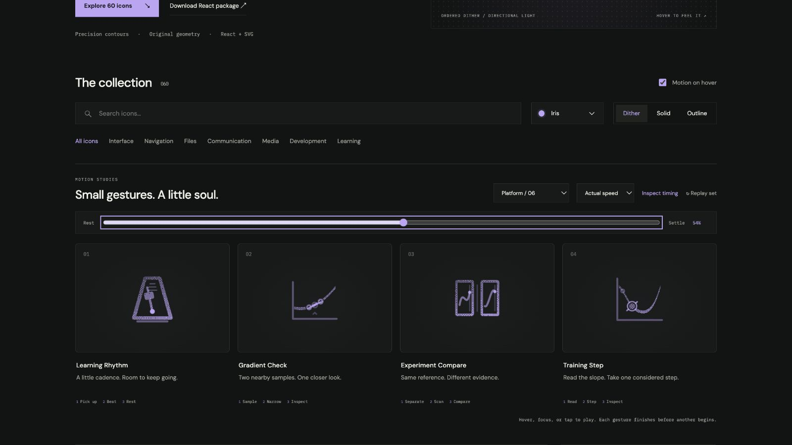

# Training Step: Interface Craft review

## Context

**Advance one optimizer update along a loss landscape.** `MomentumNesterovPhysicsLab.tsx:1226–1231` has Step motion, followed by a new prediction.

## First Impressions

A single parameter marker on a fixed bowl distinguishes one update from an endless training spinner. Its destination stays on the slope, short of the minimum.

## Visual Design

One smooth loss contour, a solid parameter point and a faint retained starting witness during travel. The moving point needs a matching knockout so the curve never crosses its face.

**Identity boundary:** The point follows the drawn curve, and the landscape remains fixed. The gesture does not reach or certify a minimum.

## Interface Design

Read the local direction, move once along the contour, then briefly illuminate the new sample and nearby normal marks. Hold the new point before the preview restores its starting position.

## Consistency & Conventions

MOT-01/02/03/05 preserve semantics, identity and a causal physical relationship. MOT-07/08/16 require stable grain and a localized response. MOT-09–15 bind full playback, exact rest, input/stillness, shared export timing and individual rendered review. Platform handoff: UI-2/4, COLOR-2/5, A11Y-2/4 and MOTION-1/4/6/7.

## User Context

The library preview is illustrative. Real optimization can increase loss; the lesson retains its numeric state and actual Run evidence. No completion or convergence claim. Use native labeled controls. Prefer still 24px solid/outline for frequent actions and dither at 48px or larger. Keep keyboard, reduced motion and motion-off useful.

## Top Opportunities

Make the landing response explain a new sample, not a collision; preserve the old location while the new one is being inspected.

## Encoded storyboard and review

**Read / Step / Inspect · 1500ms.** [training-step.ts](../../src/motions/training-step.ts) records the timestamp storyboard, commented clock and named actors. [LearningPracticeArtwork.tsx](../../src/LearningPracticeArtwork.tsx) owns the original geometry.

| Actor | Key times and attachment |
| --- | --- |
| Local slope reading | Peaks 140ms; clears before departure at 320ms |
| Parameter and knockout | Cubic parameter .2 at rest; travel 320–720ms to .66; hold through 1040ms; restore at 1300ms |
| Original-point witness | Remains faintly visible during the held new sample |
| New-sample ring and normal marks | Start after arrival; peak 800ms; clear 1040ms |

The marker samples the actual first cubic segment of the loss contour. It stops before the minimum at (13.5,18). Its knockout follows exactly, including every interpolated pose. Normal marks are derived from the tangent at the destination. The return is a preview reset, not another optimizer update.

Like the gradient probes, the dithered point now starts at its real positive coordinate rather than at zero; this preserves the full grain in React and static SVG. Solid uses a filled point; outline preserves the same outer radius. Actual-speed review shows one deliberate movement, a held sample and exact return.

Actual and half-speed sequences inspected through recovery. Eight poses at 0/10/30/44/54/60/84/100% return exactly. Dark Iris dither/outline and light Cobalt solid preserve the same inspected 60% pose. Keyboard departure, disabled motion, reduced motion, 390px layout, 24px solid and 64px dither were reviewed. The standalone SVG rest board was also rendered without JavaScript. See [batch validation](../VALIDATION.md) for evidence and limits.

**Reference position: 4 of four.**

[Rest](../motion-evidence/platform-06/pose-0.png) · [Outline](../motion-evidence/platform-06/outline-60.png) · [Light solid](../motion-evidence/platform-06/light-solid-60.png) · [Static export board](../motion-evidence/platform-06/static.svg)

