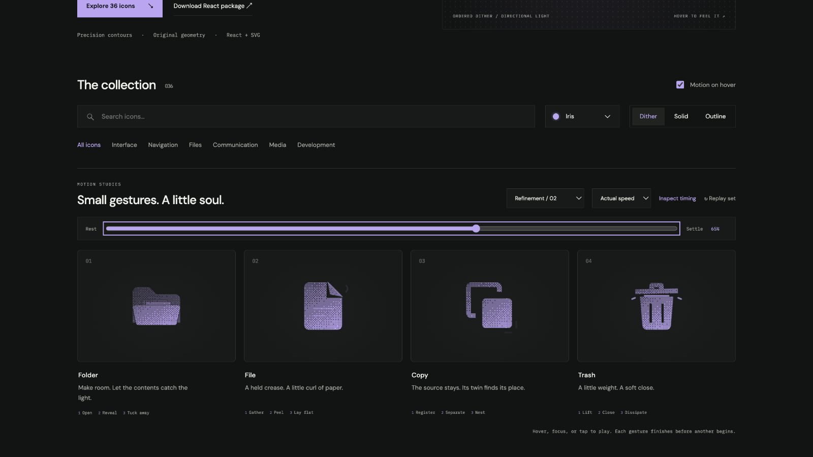

# trash: Interface Craft refinement 02

## Context
**Meaning:** an available receptacle for removal. The glyph previews a lid opening and closing, while the bin, lid, handle, and vents remain visible. This is the fourth icon in the bounded batch.

## First Impressions
The earlier lid opened and the bin responded during opening. A small rim accent appeared while the lid was still raised, so the gesture never delivered a convincing contact event. The natural climax belongs to the lid meeting the rim.

## Visual Design
The lid pivots from a left support while the bin stays planted. A separate handle follows with a much smaller lag. The handle has enough headroom for the open pose in all materials. The bin retains its two vents and grounded base.

At contact, a fine line catches the rim and two short exterior ticks spread sideways. The bin yields slightly after the lid arrives. The silhouette remains the primary visual weight; the effects clear before rest.

## Interface Design
A small brace precedes opening. The lid holds open briefly, then accelerates toward the rim. Contact occurs at 730ms; the body and rim light crest at 785ms; the exterior ticks peak at 810ms. The lid and handle dissipate the remaining motion on different timings. This later climax deliberately differs from the reveal and registration events in the other three icons.

## Consistency & Conventions
MOT-01–13 and MOT-14–16 apply. Download's causal impact is the reference: contact first, receiving object second, localized response third. The preview does not remove anything or assert that a deletion completed. No sound is generated; the weight is conveyed visually.

## User Context
Removal can be consequential. A controlled lid movement provides tactility without celebrating destruction, dissolving the bin, or scattering mock content. Its stable rest pose and reduced-motion rendering remain conventional trash icons.

## Top Opportunities addressed
1. Move the climax from opening to actual rim contact.
2. Keep the bin still until the lid arrives, then give it a restrained response.
3. Let the handle, lid, rim light, and exterior ticks dissipate separately.

## Encoded storyboard
Source: [trash.ts](../../src/motions/trash.ts). `TIMING`, `TRASH_ART`, `LID`, `HANDLE`, `BIN`, `RIM`, `IMPACT`, and `EASE` define the performance.

| Time | Action |
| --- | --- |
| 0–120ms | Lid braces downward 0.25 units. |
| 120–340ms | Lid opens −11 degrees around its left support. |
| 390–520ms | Handle finishes following; brief open hold. |
| 520–730ms | Lid accelerates back to the rim. |
| 730–785ms | Bin yields 2.5%; rim light crests after contact. |
| 730–810ms | Exterior impact ticks appear and peak. |
| 900–1010ms | Lid rebounds slightly; lights clear. |
| 1070–1240ms | Handle and lid finish settling into exact rest. |

## Rendered review
Fourth icon in Refinement / 02. Its open pose appears in the 42% reference, contact near 59%, and the visible impact at 65%. Actual/half-speed replay confirmed the later payoff. The outline retains handle clearance and the source stays recognizable through the slight compression. [Batch validation](../VALIDATION.md#focused-refinement-02--2026-09-09) covers keyboard, stillness, and responsive checks.

[Open](../motion-evidence/refinement-02/reveal.png) · [Contact](../motion-evidence/refinement-02/contact.png) · [Recovery](../motion-evidence/refinement-02/recover.png) · [Rest](../motion-evidence/refinement-02/settled.png) · [Outline](../motion-evidence/refinement-02/outline.png)
