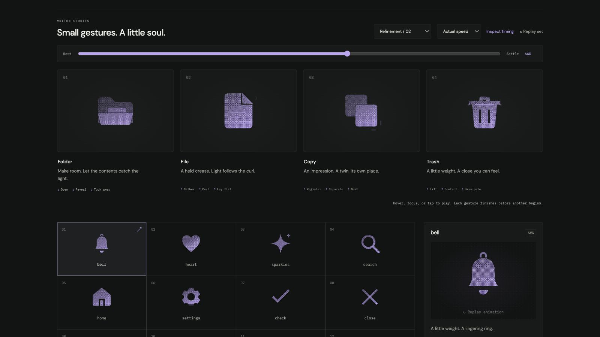

# trash: Interface Craft polish

## Context
**Meaning:** an available receptacle for removal. **Invariant:** lid, handle, vented bin, and grounded base remain visible. The preview lifts and closes the lid; it neither deletes content nor celebrates a destructive action.

## First Impressions
The previous report called the return a contact event. Closer frame review found a gap: the lid stopped above the rim, and moved away while the bin compressed. The light and ticks suggested an impact the geometry did not deliver. The correction must join the physical planes before tuning the effects.

## Visual Design
Soften the lid's four corners by 0.45 units. Retain the bin and its two vents. At contact, the lid bottom reaches y=8 exactly. During compression, lid and rim descend together to y=8.42. The receiving body widens only 1.2%, keeping the deformation restrained.

The rim light lives inside the bin's coordinate frame. Two short exterior impact strokes move outward from their separate contact sides. Their brightness peaks after the seam flash; the handle's smaller response lasts longer.

## Interface Design
Brace, lift from the left support, hold briefly, then accelerate down. The bin does not react and effects remain hidden until 750ms. Lid and rim share both compression endpoints and the same interpolation easing through 800ms. Only after that coupled compression does the lid separate for a small rebound. The handle follows at 945ms.

## Consistency & Conventions
MOT-01–16 apply. Download supplies the causal standard: contact before receiver response, then localized dissipation. `TRASH_CONTACT` defines the receiving plane and one equation positions the lid against it. The equation is checked between keyframes, not only at the impact still.

## User Context
The lid movement provides tactile feedback without falsely asserting a completed removal. There is no sound, disappearing content, or endless wobble. At small sizes and with motion off, the conventional trash silhouette remains intact.

## Top Opportunities addressed
1. Replace implied impact with actual contact maintained through compression.
2. Couple rim light to the receiving body.
3. Dissipate through a restrained rebound, outward strokes, and delayed handle.

## Encoded storyboard
Source: [trash.ts](../../src/motions/trash.ts). `TIMING`, `TRASH_ART`, `TRASH_CONTACT`, `LID`, `HANDLE`, `BIN`, `RIM`, `IMPACT`, and `EASE` define the performance.

| Time | Action |
| --- | --- |
| 0–110ms | Lid takes up its weight. |
| 110–335ms | Lid lifts −11.5° from the left support. |
| 390–510ms | Handle follows; brief readable opening. |
| 510–750ms | Accelerating closure. Lid bottom meets the bin at y=8. |
| 750–800ms | Both planes compress together to y=8.42; rim light crests at 782ms. |
| 835ms | Exterior impact strokes reach their crest. |
| 900 / 945ms | Small lid rebound, then handle response. |
| 1035–1250ms | Lights clear; all parts settle exactly. |

## Rendered review
At 60% (750ms), browser-measured lid and rim edges coincided within 0.000008 CSS pixels. At 64% (800ms), the measured difference was under 0.000016px. Normal-speed playback shows the contact before the outward response; half-speed playback makes the coupled compression visible. Solid at 24px and large outline retain the handle and vents. [Current validation](../VALIDATION.md#refinement-02-polish--2026-09-09).

[Open](../motion-evidence/refinement-02-polish/reveal.png) · [Contact](../motion-evidence/refinement-02-polish/contact.png) · [Recovery](../motion-evidence/refinement-02-polish/recover.png) · [Rest](../motion-evidence/refinement-02-polish/settled.png)
