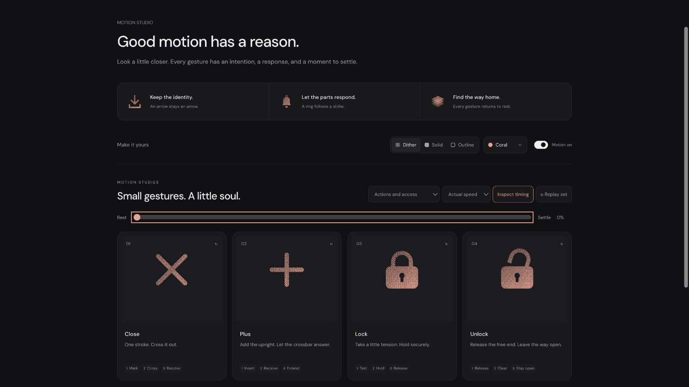

# Unlock: Interface Craft state-pair study

## Context
**Indicate open or editable access.** Complements Lock in authentication and read-only editor contexts (`components/auth/AuthEntryPage.tsx:50`, `components/lab/SplitEditor.tsx:108`). These are selection contexts, not platform integration changes. The host chooses Lock or Unlock from its actual permission state.

## First Impressions
The catalog had Lock but no distinct Unlock. Opening Lock merely for hover would lie about the current state and leave static consumers without an unlocked symbol. Add a separate semantic name, export and complete open resting drawing.

## Visual Design
Use the same rounded housing, keyhole and shackle contours as Lock. Rotate the shackle 18° around its seated right foot in the static SVG. The left foot clears the housing visibly even at rest. Keep the body and keyhole fixed. A matched housing mask hides the seated foot; a short free-end light and two small marks within the newly cleared gap provide the response.

## Interface Design
Prepare by one degree without closing the gap. Pivot to 28° by 380ms. The exposed end catches light at 440ms; two gap marks answer at 510ms. Hold through 650ms and ease back to the original OPEN 18° pose by 980ms; end at 1200ms. The glyph never passes through locked state.

## Consistency & Conventions
MOT-01/03/05/07/08/09/10/11/12/13/14/15/16. The actual drawn right foot (16.4, 11.3) is the pivot. The static 18° orientation is independent of the animated offset, preserving open identity in reduced motion and SVG exports. Unlock is a separate definition and `UnlockIcon` export. Its use never grants access by itself.

## User Context
A state pair must be distinguishable before animation starts. The open gap carries meaning; transient light only acknowledges clearance. Shared housing geometry prevents the pair from appearing to be different objects.

## Top Opportunities
1. Make the open state readable without movement.
2. Keep the seated foot anchored and the free end clear at every frame.
3. Place the small response in the newly cleared space, after release.

## Encoded storyboard and rendered review
[unlock.ts](../../src/motions/unlock.ts), **1200ms**, **Release / Clear / Stay open**.

```text
0       130         380 440 510      650          980      1200
open -- gather ---- release--light--echo--hold----open-----rest
right foot + housing + keyhole: fixed; left foot stays detached
```

[Evidence](../motion-evidence/refinement-06-rework/) shows the pair in all materials, reduced motion and small exports. A geometry regression includes the shackle thickness while checking the free end's clearance, verifies the drawn pivot, and checks response ordering. All 69 named definitions render all materials; repeated Unlock instances keep isolated masks. This new export is unreleased until the next tagged package release.


