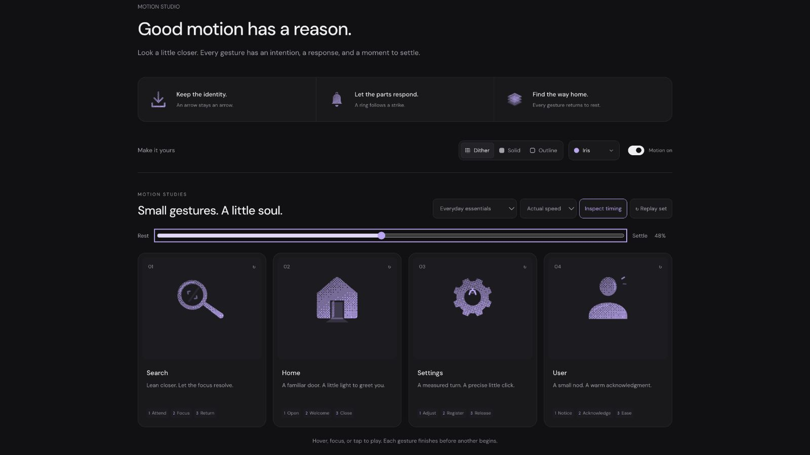

# User: Interface Craft refinement 05

## Context
**Represent a person or profile.** The learner-profile section uses UserRound in `app/src/routes/settings.tsx:459`. A friendly acknowledgment is appropriate; a gesture cannot assert identity verification or account status.

## First Impressions
The previous circular head rotated around an external pivot, so its nod mainly read as a small positional drift. The shoulder response was subtle, with no clear finishing gesture.

## Visual Design
A gently oval head makes a shallow nod readable without drawing a face. The shoulders have a clean curved crown and a grounded horizontal base. Neck clearance survives the full motion, including outline stroke. A cheek light remains attached to the head; two short exterior greeting strokes stay in the surrounding frame.

## Interface Design
Notice the visitor, make one shallow nod, and rise. The shoulders answer later with a restrained breath anchored at their base. The cheek catches light as the head begins to rise; two greeting strokes follow that reversal with a 35ms stagger. The head returns upright before the shoulders finish relaxing. There is no whole-avatar jump or persistent badge.

## Consistency & Conventions
MOT-01/02/03/04/05/06/07/08/09/10/11/12/13/14/15/16. Independent head, shoulder and greeting clocks use the existing engine and export contract. UI-2/4 and MOTION-6/7 preserve an ordinary labeled account control and a useful still version.

## User Context
This is an abstract profile glyph, not a representation of a particular person's appearance or mood. The full gesture belongs to occasional entry points. At small sizes, its static head-and-shoulders shape carries the meaning.

## Top Opportunities
1. Use slight oval geometry and shallow foreshortening to make the nod visible.
2. Separate the head's reversal, shoulder breath and greeting response.
3. Preserve a stable base and enough neck clearance in every material.

## Encoded storyboard and review
[user.ts](../../src/motions/user.ts) owns the source. Duration **1180ms**; stages **Notice / Acknowledge / Ease**.

- 130ms: attention; 390ms: nod's lowest pose.
- 500ms: rise and cheek light; 570/605ms: greeting strokes.
- 760ms: upright; 940ms: accents and shoulder breath clear.
- 1180ms: exact rest.

The 28/35% browser frames expose the nod and its reversal. At 48%, the greeting is visible beside the returning head; by 70%, the pose has softened toward rest. The ellipse-support test includes rotation, scale, translation and both outline strokes; the head never touches the shoulders. Actual/half-speed playback and keyboard-departure completion passed. Material switching preserved every actor pose.

[Rest](../motion-evidence/refinement-05/pose-0.png) · [Preparation](../motion-evidence/refinement-05/pose-10.png) · [Recovery](../motion-evidence/refinement-05/pose-70.png) · [Shared validation](../VALIDATION.md#focused-refinement-05--2026-09-10)
