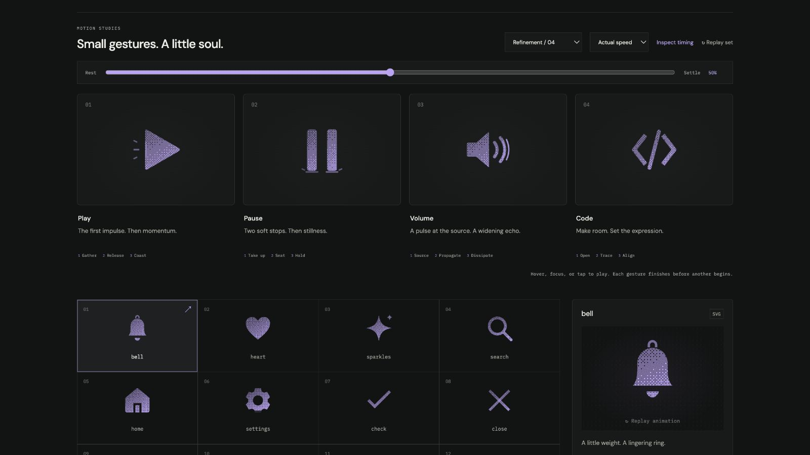

# volume: Interface Craft review

## Context

A reusable SVG action icon. Its semantic meaning is **sound propagating away from a source**. This is one of the four icons in Refinement / 04; the report supersedes its initial broad-rollout review.

## First Impressions

The earlier speaker moved as a block while two small arc fragments changed nearby. It suggested a pulse, but the source-to-distance relationship and final propagation beat were weak.

## Visual Design

The neck stays planted and the cone flexes about that attachment. The two persistent waves are mathematically concentric, with rounded band ends and deliberate radial separation. Outline uses single arc centerlines so narrow bands do not acquire heavy double borders. The diaphragm and far-arc highlights inherit their respective surfaces; the final fine wavefront lives in the surrounding frame.

**Identity boundary:** The speaker neck remains attached at both endpoints. The cone and two separated waves stay visible throughout; the final third wave is a transient response, not a new volume-level state.

## Interface Design

The cone gathers and releases first. Near and far waves respond in order, then a finer transient wavefront travels beyond them. The source settles while the last wave dissipates. The response travels outward; the whole icon does not wobble.

## Consistency & Conventions

The shared gallery typography, palette, framing, inspector, and playback controls remain intact. Color is inherited. Dither, solid, and outline share named tracks. MOT-01–08 govern identity, geometry, material, and the causal response; MOT-09–13 govern completion, exact rest, accessibility, shared timing, and rendered verification; MOT-14–16 require truthful preview semantics, this individual review, and a legible climax.

## User Context

The preview conveys sound propagation without playing audio or setting loudness. Two permanent waves preserve the conventional volume identity. At small sizes the silhouette must carry the meaning without depending on the external front.

## Top Opportunities

1. Anchor the source, then let distance determine response timing.
2. Keep the near and far bands separated through their full motion.
3. Make the final wavefront fine but perceptible, with its own dissipation.

## Encoded storyboard

**Duration:** 1280ms. **Sequence:** Source / Propagate / Dissipate.

```text
0ms    Planted speaker and two concentric waves
115ms  Cone gathers at its fixed neck
250ms  Source releases pressure
270ms  Attached diaphragm light peaks
375ms  Near wave receives the impulse
505ms  Far wave reaches its crest
535ms  Far arc catches light
635ms  Fine exterior wavefront reaches its full size
650ms  Speaker is still while the front continues
970ms  Transient front has cleared
1040ms Both persistent waves are neutral
1280ms Exact rest
```

One named `TIMING` object and per-actor configuration live in [volume.ts](../../src/motions/volume.ts). Named SVG groups and local effect attachment live in [ControlArtwork.tsx](../../src/ControlArtwork.tsx). Native playback, inspection, and standalone CSS use the same tracks.

| Named part | Keyframe times (ms) |
| --- | --- |
| `cone` | 0, 115, 250, 420, 650, 1280 |
| `wave-near` | 0, 200, 375, 565, 850, 1280 |
| `wave-far` | 0, 320, 505, 705, 1040, 1280 |
| `diaphragm-light` | 0, 150, 270, 495, 1280 |
| `wave-light` | 0, 435, 535, 840, 1280 |
| `sound-front` | 0, 485, 635, 970, 1280 |

## Rendered review

The source remains attached during the preparation and release. At 40% the far wave is strongest; at 50% the fine exterior arc makes propagation visible. The persistent wave gap stays open. Outline reads as a continuous speaker contour with light, distinct arcs. At 24px solid, the two-wave volume identity remains readable.

Reviewed in the live browser at actual and half speed, plus 0%, 10%, 30%, 40%, 50%, 62%, 82%, and 100%. All four icons have identical computed poses at the two neutral endpoints. Paused dither-to-outline switching at 40% preserves every named transform. Keyboard departure finishes the gesture. Reduced motion clears transforms and hides accents; motion-off disables study playback. See [VALIDATION.md](../VALIDATION.md) for the complete batch evidence and limits.

**Visual reference:** icon 3 from the left, in the new four-icon study group.



[Rest](../motion-evidence/refinement-04/pose-0.png) · [Preparation](../motion-evidence/refinement-04/pose-10.png) · [Recovery](../motion-evidence/refinement-04/pose-82.png) · [Outline](../motion-evidence/refinement-04/outline-40.png) · [Light solid](../motion-evidence/refinement-04/light-solid-62.png)
