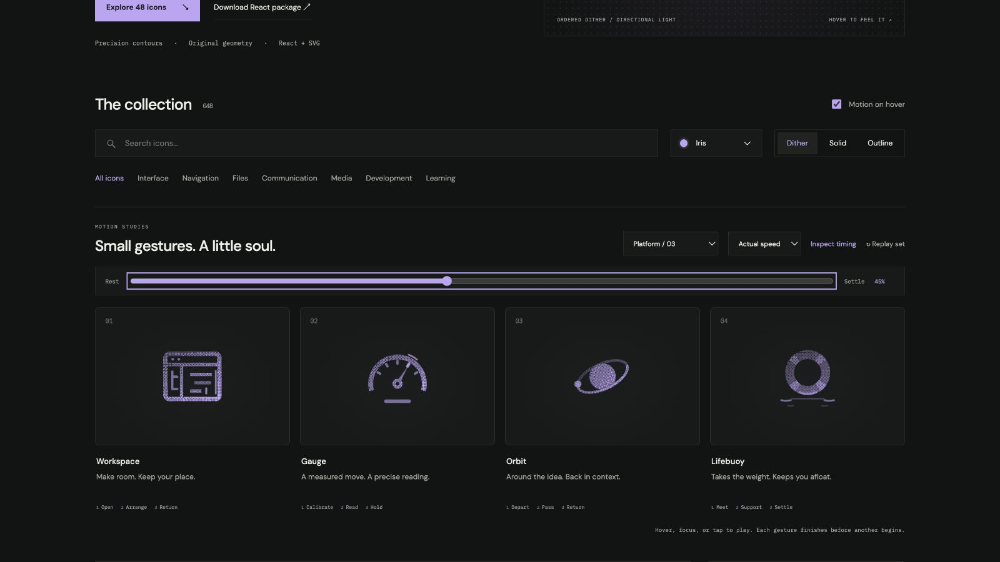

# workspace: Interface Craft review

## Context

**Make room in an organized working surface.** CraftingAttention defines Workspace as the Learner's growing codebase and saved state. Its command palette currently uses FolderTree for Workspace navigation. This icon shows that codebase in its working environment; it does not simulate editing a file.

## First Impressions

The fixed window, file tree, and indented source lines read as an organized code surface. Moving only the divider creates a clear opportunity: the code can occupy the newly available space, then a caret acknowledges readiness.

## Visual Design

The rounded frame and toolbar carry the strongest outline. The file tree is quieter; source lines have three distinct lengths and two indentation levels. Their order never changes. The first browser pass exposed a tight tree/divider gap; the branch ends were shortened to retain at least half a viewBox unit of clearance at maximum opening.

**Identity boundary:** The frame, toolbar, and file tree stay fixed. Source content remains inside the editor. The divider never collides with the tree, and the icon never becomes an empty window.

## Interface Design

The divider first creates room. The source group follows, then its first and indented lines extend in a small stagger. A caret and short editor-edge catch answer after the arrangement is established. The extra space closes without deleting or reordering content.

## Consistency & Conventions

MOT-01/03/05 establish stable organization and response order. MOT-07/08/16 bind grain to the moving source and localize the climax to the editor. MOT-09–15 retain complete playback, exact return, stillness, shared export timing, and individual review. Platform handoff: UI-2/4, COLOR-2/5, A11Y-2/4, MOTION-1/4/6/7. Use the native parent's real action and label.

## User Context

Workspace is revisited frequently. Prefer a still 24px solid/outline glyph in dense navigation. The full gesture suits an infrequent invitation to resume work. It does not promise a completed Run, changed source, or saved Checkpoint.

## Top Opportunities

1. Let the fixed file tree preserve orientation while the editor opens.
2. Make line extension follow available space rather than simulate typing.
3. Put the final response inside the editor, not around the whole window.

## Encoded storyboard and review

**Open / Arrange / Return · 1360ms**. [workspace.ts](../../src/motions/workspace.ts) contains its timestamp storyboard, named timing, and actor configuration. [PlatformNavigationArtwork.tsx](../../src/PlatformNavigationArtwork.tsx) binds the parts.

| Actor / origin | Key times (ms) |
| --- | --- |
| `divider` / 9.5,8.5 | 100 gather; 340 open; 700 hold; 1120 home |
| `source` / 12.2,14 | 100 start; 340 arrange; 700 hold; 1120 home |
| `source-first` / 12.2,11.275 | 340 start; 420 extend; 700 hold; 1120 home |
| `source-second` / 13.6,14.125 | 340 start; 490 extend; 700 hold; 1120 home |
| `editor-edge` / 20,14; `editor-caret` / 17.75,17 | 490 start; 560 peak; 920 clear |

Every track begins at 0 and ends at 1360ms. Reviewed actual/half-speed playback and eight poses, including exact 0/100% equality. All materials retain the same paused 36% pose. The 45% frame shows the caret and edge response; compact collection views preserve the tree. Keyboard departure finishes, reduced motion stays still, and motion-off disables the studies. The 390px layout has no horizontal overflow. See [validation](../VALIDATION.md).

**Reference position: 1 of four.**

[Rest](../motion-evidence/platform-03/pose-0.png) · [Outline](../motion-evidence/platform-03/outline-36.png) · [24px solid](../motion-evidence/platform-03/compact-solid-24.png)

## Outline material correction — 2026-10-02

**Invariant and critique:** A fixed workspace frame retains its source and tree. Outline frame and toolbar bands plus the divider and source bars; the divider still creates space before the source extends.

**Material rule:** Reuse the reader's 0.5-unit Outline edges and transparent cores. Fine text and small semantic dots stay readable. Applicable: MOT-01, MOT-03, MOT-07, MOT-10, MOT-11, MOT-12, MOT-13 and MOT-15.

**Storyboard retained:** Open / Arrange / Return, 1360ms. Authored tracks remain: `divider`, `source`, `source-first`, `source-second`, `editor-edge`, `editor-caret`. This correction changes material, not the semantic action or timing.

**Rendered review:** [Before/after and compact review](../outline-audit/README.md#correction-evidence) plus [actual 50% browser pose](../outline-audit/browser/pose-50.png). The six inspected poses are 0%, 10%, 35%, 50%, 75% and 100%; actor binding, material-switch pose preservation, keyboard completion and stillness checks are recorded with that evidence. User visual approval remains pending. Standalone SVG retains the authored CSS tracks; CSS hover still ends on departure while React finishes its gesture.
