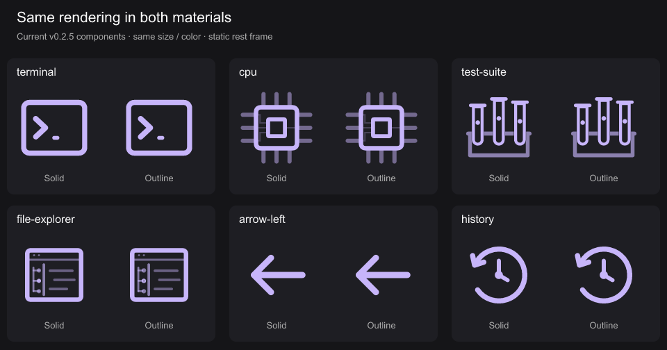
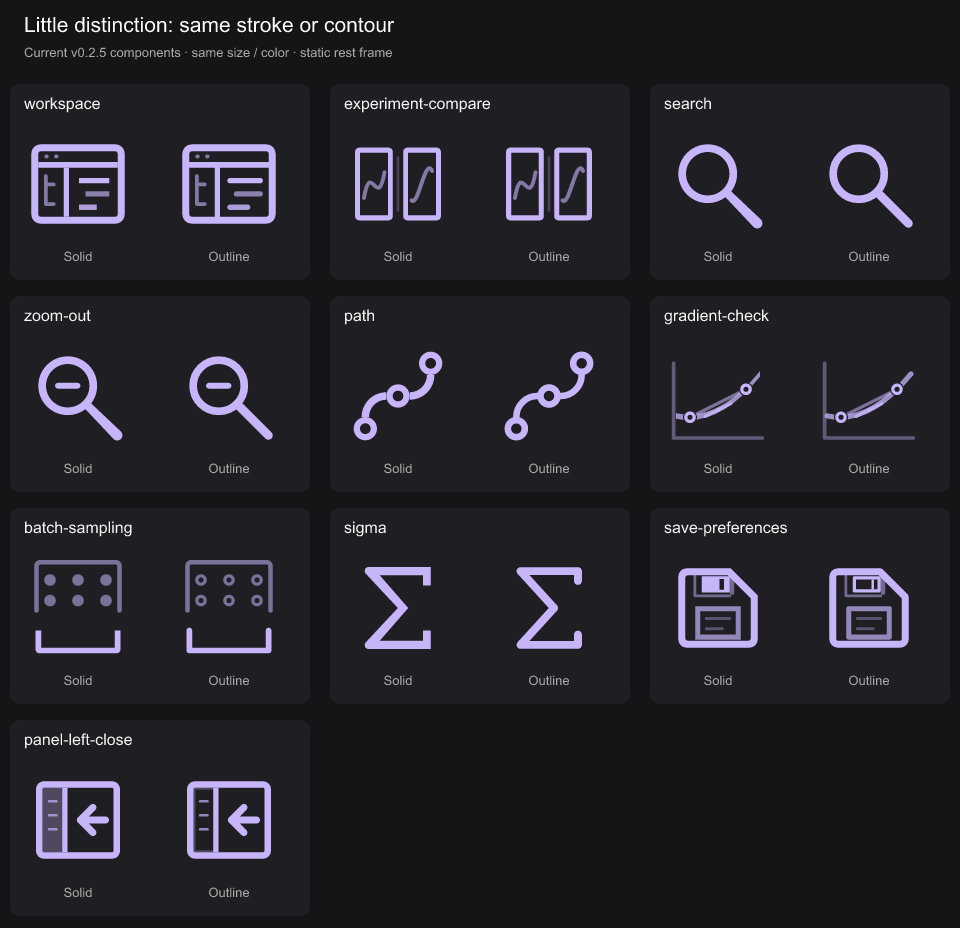
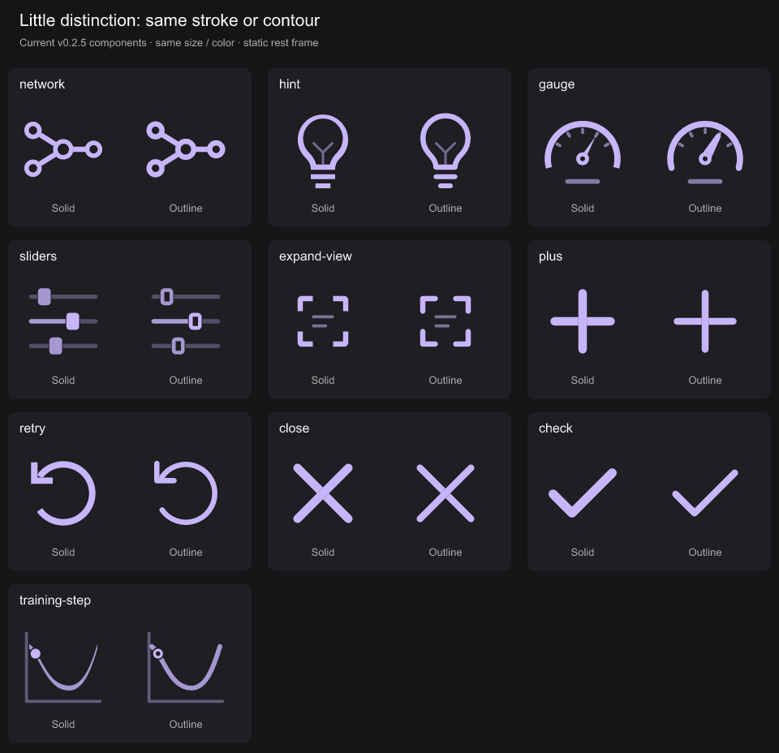
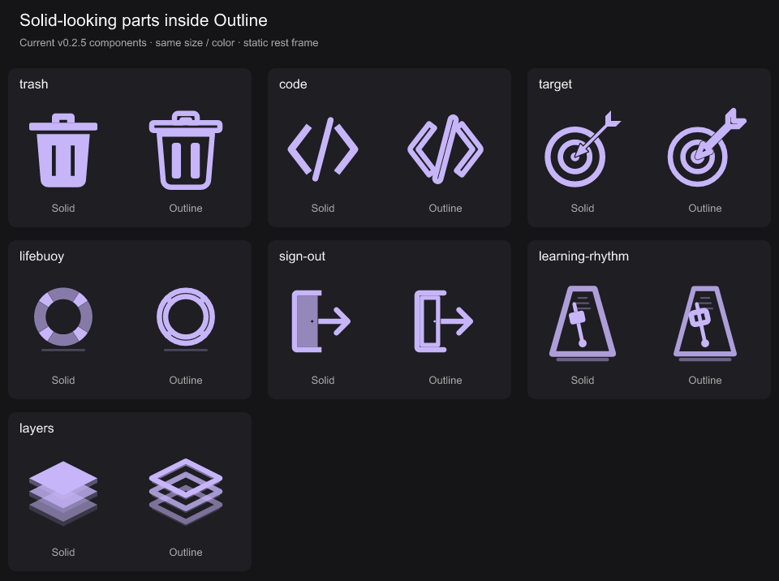
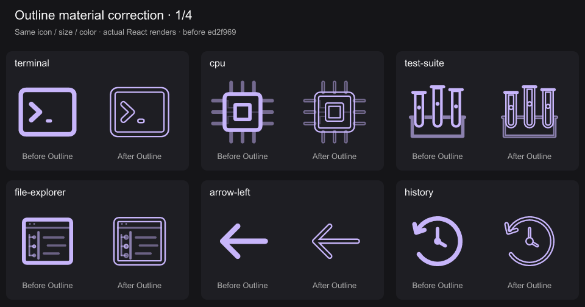
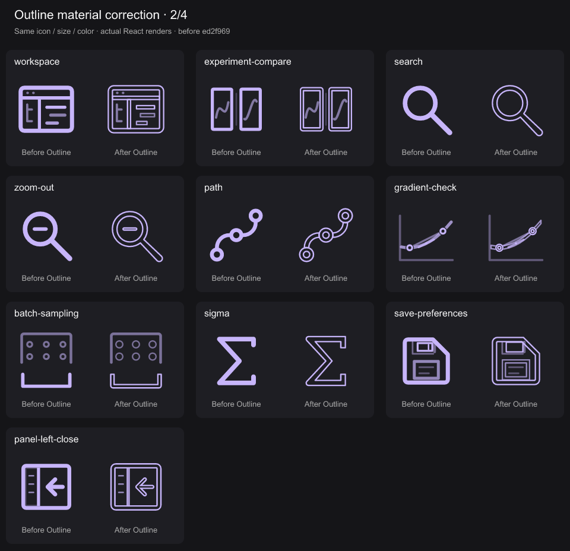
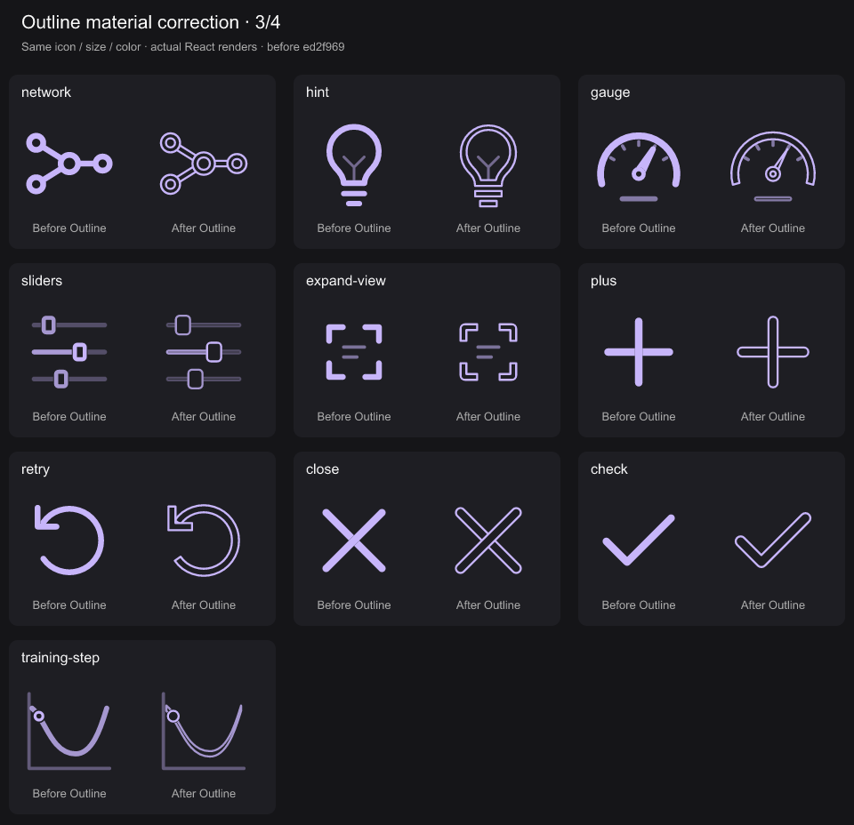
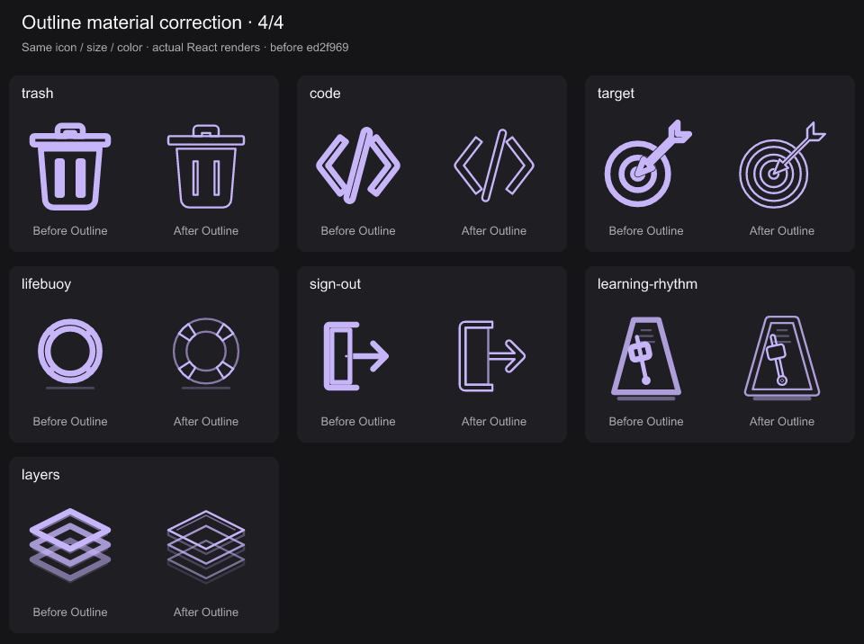
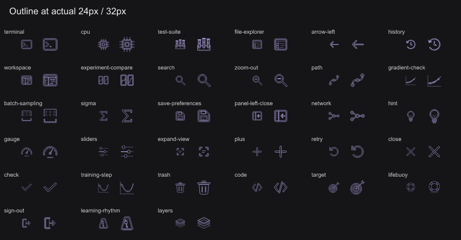

# Outline material audit — 2026-10-02

Audited all 89 icons in source revision `fc8fe4d` (package 0.2.5), at the static rest frame. Flagged 33 candidates for an Outline material correction: six visually indistinguishable pairs, twenty pairs whose main contours remain single solid strokes, and seven with localized solid-looking parts. These are different failure classes; the seven partial cases do not have entirely filled bodies.

The criterion is the distinct transparent contour core already implemented for reader icons in `src/ReaderArtwork.tsx` and `src/SelectionArtwork.tsx`, rather than merely changing stroke weight. Small pupils, word strokes, and semantic dots are not automatically defects. Some of the twenty have changed small details, which the images expose; they are not pixel-identical claims.

## Visually indistinguishable pairs (6)

Terminal, CPU, Test Suite, File Explorer, Back (`arrow-left`), History.

Back and History produce exact RGBA matches at 240px with the audit renderer. The remaining four have minor raster differences but no distinct material treatment. For Back and History, `NavigationToolsArtwork.ink()` explicitly returns the same path for both non-dither materials. In the other four, an existing narrow ring or filled band is replaced by its centerline stroke with essentially the same visible coverage.



## Main contours retain Solid's stroke treatment (20)

Workspace, Experiment Compare, Search, Zoom Out, Path, Gradient Check, Batch Sampling, Sigma, Save Preferences, Collapse Panel (`panel-left-close`), Network, Hint, Gauge, Sliders, Expand View, Plus, Retry, Close, Check, Training Step.

These are visual-review candidates, not twenty identical pixel buffers. Batch Sampling changes the dots, Sliders changes the knobs, Save Preferences changes the shutter, and Training Step changes the parameter dot. Their other main contours still do not acquire the transparent core of the reader Outline material. Check, Close, and Plus remain filled single strokes with only different weights. Search and Zoom Out retain filled handles and substantially the same ring. Gauge's outline needle becomes heavier.




## Localized solid-looking parts (7)

| Icon | Visible issue | Source |
| --- | --- | --- |
| Trash | Narrow rectangular cutouts become filled-looking bars when both edges receive a 1.4-unit stroke. | `src/FileArtwork.tsx`, `src/motions/trash.ts` |
| Code | Slash and chevrons are stroked closed solid silhouettes; the slash's opposing edges almost meet and the glyph becomes heavier. | `src/ControlArtwork.tsx`, `src/motions/code.ts` |
| Target | Dart shaft and fins collapse into solid-looking ink; target rings are already stroked in Solid. | `src/LearningArtwork.tsx`, `src/motions/target.ts` |
| Lifebuoy | Two 1.4-unit circular strokes at radii 7 and 5.35 leave only a 0.25-unit radial gap; wraps cross that gap. | `src/PlatformNavigationArtwork.tsx` |
| Sign Out | Left frame stroke and door-leaf stroke meet, producing a heavy continuous strip; arrow remains a single solid stroke. | `src/PlatformActionsArtwork.tsx` |
| Learning Rhythm | Filled pivot persists in Outline; arm runs through the small weight's contour core. | `src/LearningPracticeArtwork.tsx` |
| Layers | Three side-face paths still inherit `currentColor` fill in Outline. | `src/CraftedArtwork.tsx` |



## Evidence and limits

- Rendered all 89 current React components in both materials, same color and size, motion disabled. Reviewed complete catalog sheets, then rendered the 33 pairs above at 112px for inspection.
- Compared alpha coverage at 240px to find close pairs, then inspected the geometry; coverage similarity alone does not establish a bug.
- Ordinary browser loaded `https://dithered.dev`, displayed version 0.2.5 and 89 icons. Selected Outline, disabled motion, expanded the catalog, and confirmed the Sign Out / Check appearance and CPU material paths there.
- PNGs are actual component renders, not generated concept art or browser screenshots. They show rest-frame material behavior; this audit does not certify every animation pose, every compact size, or npm installation parity.
- No icon geometry, motion, package version, or deployment was changed. No test suite or build needed for this evidence-only change.

Regenerate the four comparison sheets and exact-match checks from repository root:

```sh
node_modules/.bin/tsx docs/outline-audit/render.tsx
```

## Correction evidence

All 33 candidates now use the existing reader material's 0.5-unit contour edge. Filled silhouettes expose their boundaries; thick open strokes expose a transparent center. Fine text and semantic dots retain their existing treatment. History's hand hub and Learning Rhythm's pivot/weight exclude the underlying moving strokes so their cores remain transparent.

The authored Solid silhouettes, semantic actors, timing, and causal sequences remain intact (MOT-01/03/07/12/15). Material changes rebind animation targets while preserving the inspected time (MOT-13). Individual decisions and retained storyboards are recorded in each icon's `docs/icon-reviews/` entry. User visual review remains pending.

Before left; corrected Outline right. These are actual static React renders at matching color and size. `before.json` preserves the original SVGs from audit commit `ed2f969`.








Validation completed locally:

- Consumer SVG export/raster integration checks pass for all 33 changed icons, including transparent interiors with two inherited colors. Typecheck and production build pass; downloadable reference SVG regenerated.
- Baseline raster comparison confirms 234 renders remain pixel-identical: all 89 Solid, all 89 Dither, and the other 56 Outline icons. All 33 corrected Outline renders differ visibly. See `validation.json`.
- Browser review inspected all 33 icons at 0%, 10%, 35%, 50%, 75%, and 100%; semantic parts remain recognizable and return to rest (MOT-01/10). Actual paused DOM exports and contact sheets are in `browser/paused-svg.json` and `browser/pose-*.png`.
- Keyboard Enter replays work for all 33 icons and complete cleanly. Reduced motion and Motion off leave zero running animations while retaining every drawing (MOT-11). See `browser/keyboard.json` and `browser/stillness.json`.
- Outline → Solid → Outline at 50% retains each icon's inspected time, part transforms, and opacity. See `browser/material-swap.json`.
- Compact light/dark browser views and the ordinary local catalog confirm the material renders on host backgrounds and survives the SVG export lane. React retains full replay behavior; standalone SVG keeps the documented CSS hover lifecycle limitation.

No package version or production deployment changed.

Run the interactive before/after review with `npm run dev`, then open `http://127.0.0.1:4192/docs/outline-audit/review.html`. Select material, size, frame, or background; focus a current icon to replay.

```sh
node_modules/.bin/tsx docs/outline-audit/render-comparison.tsx
node_modules/.bin/tsx docs/outline-audit/render-frames.tsx
node_modules/.bin/tsx --test tests/outline-material.integration.test.tsx
```
